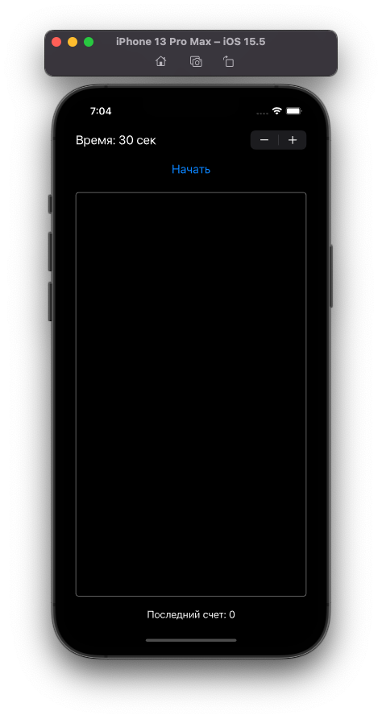
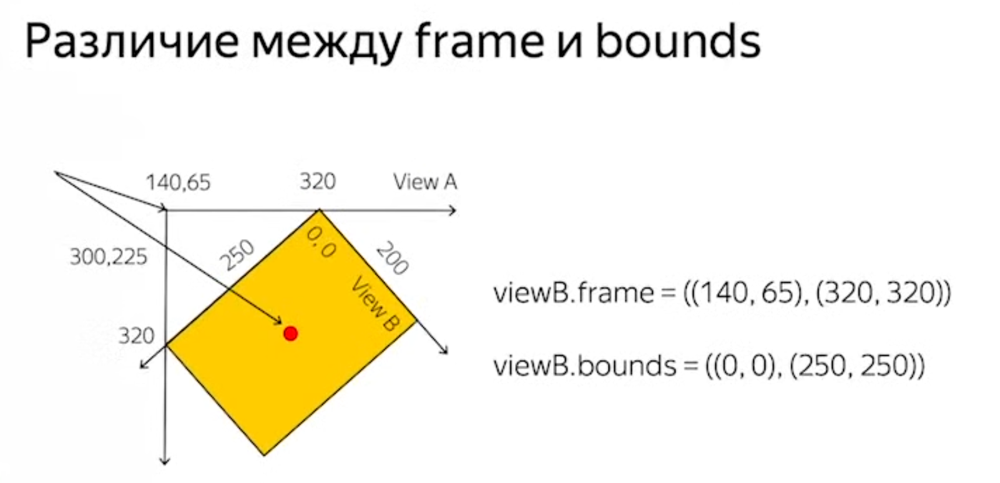

#  TapGame
[«Разработка под iOS. Начинаем»](https://www.youtube.com/watch?v=RR5o5ki0888&list=PLQC2_0cDcSKA0zy20X9c5rQKNg3rkSK7c&index=25)

# Оглавление
1. [View guide](#View)
	+ [UIView](#Uiview)
	+ [UIButton](#Uibutton)
	+ [UIStepper](#Uistepper)
	+ [NSLayoutConstraint (Перемещение объекта)](#NSLayoutConstraint)
2. [Core Guide](#Core)
	+ [Timer](#Timer)

# <a name="View"></a> View Guide

<a name="Uiview"></a>
## UIView
### Установить рамку UIView
```swift 
gameView.layer.borderWidth = 1 
gameView.layer.borderColor = UIColor.gray.cgColor 
gameView.layer.cornerRadius = 5 
```
<p align="center">
  
</p>

<a name="Uibutton"></a>
## UIButton
### Установить заголовок UIButton
```swift
startButton.setTitle("Text", for: .normal)
```

<a name="Uistepper"></a>
## UIStepper
### Активировать/Деактивировать UIStepper
```swift
stepper.isEnabled = false // true
```

<a name="NSLayoutConstraint"></a>
## NSLayoutConstraint
### IBOutlet для constraints
```swift
@IBOutlet weak var shapeX: NSLayoutConstraint!
@IBOutlet weak var shapeY: NSLayoutConstraint!
```

### Frame vs Bounds
Frame - Внешние границы и расположение View <br>
Bounds - Внутренние границы и расположение View
<p align="center">
  
</p>

### Перемещение объекта
```swift
let maxX = gameView.bounds.maxX - gameObject.frame.width
let maxY = gameView.bounds.maxY - gameObject.frame.height
shapeX.constant = CGFloat(arc4random_uniform(UInt32(maxX)))
shapeY.constant = CGFloat(arc4random_uniform(UInt32(maxY)))
```

# <a name="Core"></a>Core
<a name="Timer"></a>
## Timer
### TimeInterval
TimeInterval - обертка над Double для временных интервалов
```swift
private var gameTimeLeft: TimeInterval = 0 
private var objectMovingTime: TimeInterval = 2
``` 

### Timer
Создание таймера
```swift
gameTimer = Timer.scheduledTimer(timeInterval: 1,
				target: self, 
				selector: #selector(timeTick), 
				userInfo: nil, repeats: true)
```
Вызывает функцию timeTick каждую секунду до принудительной остановки
```
selector - для подключения функций с @objc
```

Остановка/Запуск таймера
```swift
objectTimer?.invalidate()
```

Сообщение таймеру о вызове target (принудительный вызов функции таймера)
```swift
objectTimer?.fire()
```
