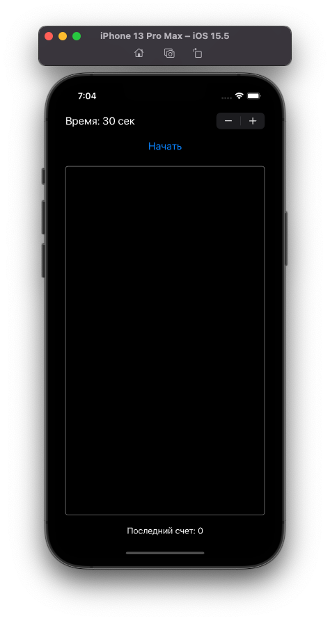

#  TapGame
[«Разработка под iOS. Начинаем»](https://www.youtube.com/watch?v=RR5o5ki0888&list=PLQC2_0cDcSKA0zy20X9c5rQKNg3rkSK7c&index=25)


## Установить границы UIView
```swift 
gameView.layer.borderWidth = 1 
gameView.layer.borderColor = UIColor.gray.cgColor 
gameView.layer.cornerRadius = 5 
```
<p align="center">
  
</p>

